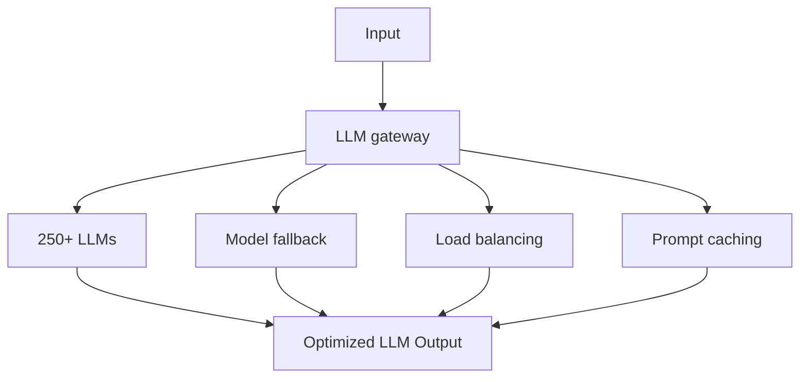

<Accordion title="Set up Respan">
1. **Sign up** — Create an account at [platform.respan.ai](https://platform.respan.ai)
2. **Create an API key** — Generate one on the [API keys page](https://platform.respan.ai/platform/api/api-keys)
3. **Add credits or a provider key** — Add credits on the [Credits page](https://platform.respan.ai/platform/api/credits) or connect your own provider key on the [Integrations page](https://platform.respan.ai/platform/api/integrations)
</Accordion>

---

## What is AI gateway?
Respan's AI Gateway is a gateway that lets you interface with 250+ large language models (LLMs) via one unified API.



### Considerations:
- May not be suitable for products with strict latency requirements (**50 - 150ms** added).
- May not be ideal for those who do not want to integrate a third-party service into the core of their application.

## Use AI gateway
### 1. Get your Respan API key

After you create an account on [Respan](https://platform.respan.ai), you can get your API key from the [API keys page](https://platform.respan.ai/platform/api/api-keys).

<Frame className="rounded-md">

</Frame>

### 2. Set up LLM provider API key

<Tip>
**Environment Management**: To separate test and production environments, create separate API keys for each environment instead of using an `env` parameter. This approach provides better security and clearer separation between your development and production workflows.
</Tip>

<Info>For all AI gateway users, you have to add your own credentials to activate AI gateway. We will use your credentials to call LLMs on your behalf. </Info>
For example, if you want to use OpenAI, you have to add your OpenAI API key to activate AI gateway.
We won't use your credentials for any other purposes.

- [Set up LLM provider API key](https://platform.respan.ai/platform/api/providers)

### 3. Call a LLM
You can use the standard API call to connect 250+ LLMs.
<CodeGroup>
```python Python
import requests
def demo_call(input,
              model="gpt-4o-mini",
              token="YOUR_RESPAN_API_KEY"
              ):
    headers = {
        'Content-Type': 'application/json',
        'Authorization': f'Bearer {token}',
    }

    data = {
        'model': model,
        'messages': [{'role': 'user', 'content': input}],
    }

    response = requests.post('https://api.respan.ai/api/chat/completions', headers=headers, json=data)
    return response

messages = "Say 'Hello World'"
print(demo_call(messages).json())
```

```TypeScript TypeScript
fetch('https://api.respan.ai/api/chat/completions', {
  method: 'POST',
  headers: {
    'Content-Type': 'application/json',
    'Authorization': 'Bearer YOUR_RESPAN_API_KEY'
  },
    body: JSON.stringify({
        model: 'gpt-4o-mini',
        messages: [{role: 'user', content: "Say 'Hello World'"}]
    })
})
.then(response => response.json())
.then(data => console.log(data));
```

```bash Bash
curl -X POST "https://api.respan.ai/chat/completions"
-H "Content-Type: application/json"
-H "Authorization: Bearer Your_Respan_API_Key"
-d "{
  "model": "gpt-4o-mini",
  "messages": [{"role": "user", "content": "Hello"}],
}"
```

```PHP PHP
<?php
  $ch = curl_init();

  curl_setopt($ch, CURLOPT_URL, "https://api.respan.ai/chat/completions");
  curl_setopt($ch, CURLOPT_POST, 1);
  curl_setopt($ch, CURLOPT_HTTPHEADER, array(
    "Content-Type: application/json",
    "Authorization: Bearer Your_Respan_API_Key",
  ));
  curl_setopt($ch, CURLOPT_POSTFIELDS, json_encode(array(
    "model" => "gpt-4o-mini",
    "messages" => array(["role" => "user", "content" => "Hello"]),
  )));

  $response = curl_exec($ch);
  curl_close($ch);
?>
```

```Go Go
package main
import (
  "bytes"
  "net/http"
)

func main() {
  url := "https://api.respan.ai/chat/completions"
  method := "POST"

  payload := []byte(`{
    "model" : "gpt-4o-mini",
    "messages": [{"role": "user", "content": "Hello"}],
  }`)

  client := &http.Client{}
  req, err := http.NewRequest(method, url, bytes.NewBuffer(payload))

  if err != nil {
    panic(err)
  }

  req.Header.Add("Content-Type", "application/json")
  req.Header.Add("Authorization", "Bearer Your_Respan_API_Key")

  res, err := client.Do(req)
  defer res.Body.Close()
}
```
</CodeGroup>

### 4. Parameters
<AccordionGroup>
  <Accordion title="OpenAI Parameters">
    We support all OpenAI parameters, which is the standard format for LLMs. You can check out important [OpenAI parameters in this page](/apis/develop/gateway/chat-completions#openai-compatible-parameters). You can also learn more about OpenAI parameters [here](https://platform.openai.com/docs/api-reference/chat).
  </Accordion>

  <Accordion title="Respan Parameters">
    Use these when you want to achieve specific goals. For example, you can use `fallback_models` to specify fallback models when the primary model is down. You can check out all [Respan parameters in this page](/apis/develop/gateway/chat-completions#respan-parameters).
  </Accordion>
</AccordionGroup>

## Integrate with your existing AI framework
Respan offers various integration options, including all mainstream LLM frameworks and REST APIs.

### Supported frameworks

<CardGroup cols={2}>
<Card href="/integrations/gateway/openai/openai-sdk">
  
  
</Card>
<Card href="/integrations/gateway/langchain">
  
  
</Card>
<Card href="/integrations/tracing/vercel-tracing#gateway">
  
  
</Card>
<Card href="/integrations/gateway/llama-index">
  
  
</Card>
<Card href="/integrations/gateway/google_genai">
  
  
</Card>
<Card href="/integrations/gateway/anthropic">
  
  
</Card>
</CardGroup>

