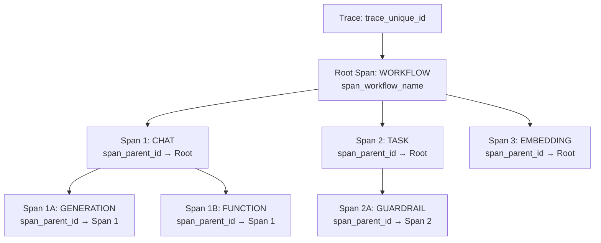
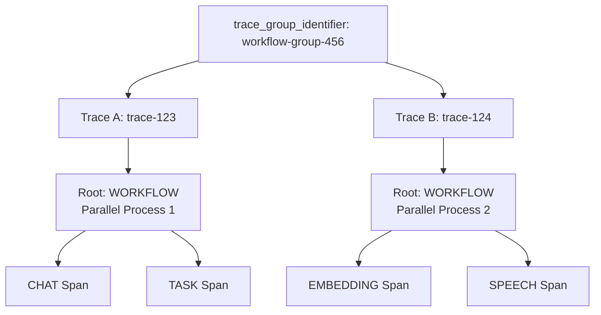

## Overview

Respan's observability is built around one core concept: **different views of the same underlying data**. Every LLM interaction is stored as a **log** — a single record containing the input, output, model, metrics, and metadata. All views present the same log data, just organized differently for different use cases:

<CardGroup cols={2}>
<Card title="Logs" icon="list">
  **Plain view** - Individual LLM requests as they happen
</Card>
<Card title="Traces" icon="route">
  **Hierarchical view** - Multi-step workflows and AI agent operations
</Card>
<Card title="Threads" icon="messages">
  **Conversational view** - Linear chat interface for dialogue systems
</Card>
<Card title="Scores" icon="chart-line">
  **Evaluation view** - Quality assessments and performance metrics
</Card>
</CardGroup>

<Warning>
All four views show the **same underlying data** - they just organize and present it differently. The core data structure remains consistent across all views.
</Warning>

## How Respan stores your data

When you send an LLM request through Respan — whether via the [LLM Gateway](/documentation/features/gateway/setup), the [logging API](/documentation/features/tracing/logs/quickstart), or a [tracing SDK](/documentation/getting-started/quickstart/tracing) — Respan creates a **log** record.

Every log uses a universal `input` / `output` design. The system automatically:
- Serializes your data regardless of format (messages array, text string, embeddings vector, audio metadata)
- Extracts type-specific fields (tool calls, thinking blocks, etc.)
- Calculates metrics when possible (cost, token counts, latency)
- Associates the log with traces, threads, and customers based on the identifiers you provide

### What's in a log

A log captures everything about a single LLM interaction:

| Category | What it stores | Key fields |
|----------|---------------|------------|
| **Content** | What was sent and received | `input`, `output`, `model`, `log_type` |
| **Metrics** | Performance and cost data | `latency`, `cost`, `usage`, `time_to_first_token` |
| **Identity** | Who and what | `customer_identifier`, `metadata`, `thread_identifier`, `group_identifier` |
| **Tracing** | Where in the workflow | `trace_unique_id`, `span_parent_id`, `span_name` |
| **Config** | LLM settings | `temperature`, `max_tokens`, `tools` |
| **Status** | Success or failure | `status_code`, `error_message` |

For the complete field reference, see [Log fields & parameters](/documentation/features/tracing/logs/log-parameters). For per-type input/output formats, see [Log types](/documentation/features/tracing/logs/log-content-types).

## Logs

<Info>
A log represents a single LLM request. This is the foundational data that powers all other views.
</Info>

Every log has a `log_type` that determines its input/output format. The most common is `chat` (messages in, assistant message out), but Respan also supports `embedding`, `speech`, `transcription`, `workflow`, `agent`, and more. See [Log types](/documentation/features/tracing/logs/log-content-types) for the full list.

## Traces

<Info>
Traces organize the same log data into hierarchical workflows, perfect for complex AI agent operations and multi-step processes.
</Info>

Traces group related logs using **spans** to show the execution flow of multi-step processes. Each span corresponds to a log entry but adds hierarchical context.

### Trace structure

### Key trace fields

- **`trace_unique_id`**: Groups all spans in the same workflow
- **`span_unique_id`**: Individual span identifier (maps to log ID)
- **`span_parent_id`**: Creates the hierarchical structure
- **`span_name`**: Descriptive name for the operation
- **`span_workflow_name`**:  The nearest workflow this span belongs to

### Multi-trace grouping

Complex workflows can span multiple traces using `trace_group_identifier`:

## Threads

<Info>
Threads organize the same log data in a conversational format, ideal for chat applications and dialogue systems.
</Info>

### Thread structure
- **Thread ID**: Unique identifier for the conversation
- **Messages**: Ordered sequence of user and assistant messages (each message maps to log entries)

<Info>
Notice how each message in the thread references a `log_id` - this shows how threads are just a different presentation of the same underlying log data.
</Info>

## Scores

<Info>
Scores organize the same log data with evaluation metrics and quality assessments, perfect for monitoring LLM performance and conducting evaluations.
</Info>

Scores are evaluation results that are attached to specific logs. Each score represents a quality assessment or performance metric for a particular LLM request.

### Score structure

Scores are linked to logs through the `log_id` field and can be created by two types of evaluators:

- **Platform evaluators**: Use `evaluator_id` (UUID from Respan platform)
- **Custom evaluators**: Use `evaluator_slug` (your custom string identifier)

### Key score fields

- **`id`**: Unique score identifier
- **`log_id`**: Links the score to its corresponding log entry
- **`evaluator_id`**: UUID of Respan platform evaluator (optional)
- **`evaluator_slug`**: Custom evaluator identifier (optional)
- **`is_passed`**: Whether the evaluation passed defined criteria
- **`cost`**: Cost of running the evaluation
- **`created_at`**: When the score was created

<Info>
Each evaluator can only have one score per log, ensuring data integrity and preventing duplicate evaluations.
</Info>

### Score value types

<Warning>
**Critical: Use the correct value field based on evaluator's `score_value_type`**
</Warning>

Scores support four different value types based on the evaluator's `score_value_type`:

| Evaluator's `score_value_type` | Use This Field | Data Type | Example |
|--------------------------------|----------------|-----------|---------|
| `numerical` | `numerical_value` | number | `4.5` |
| `boolean` | `boolean_value` | boolean | `true` |
| `categorical` | `categorical_value` | array of strings | `["excellent", "coherent"]` |
| `comment` | `string_value` | string | `"Good response quality"` |

#### Detailed descriptions

**Numerical Scores**
- **Use case**: Ratings, confidence scores, quality metrics
- **Range**: Defined by evaluator's `min_score` and `max_score`
- **Example**: Rating response quality from 1-5

**Boolean Scores**
- **Use case**: Pass/fail evaluations, binary classifications
- **Values**: `true` or `false`
- **Example**: Content safety check

**Categorical Scores**
- **Use case**: Multi-choice classifications
- **Values**: Array of predefined choices from evaluator's `categorical_choices`
- **Example**: `["relevant", "accurate", "helpful"]`

**Comment Scores**
- **Use case**: Qualitative feedback, explanations
- **Values**: Free-form text
- **Example**: Detailed evaluation reasoning

### Evaluator types

Scores are created by evaluators, which come in three types:

**LLM Evaluators (`type: "llm"`)**
- AI-powered evaluation using language models
- Requires `evaluator_definition` prompt
- Supports all score value types

**Human Evaluators (`type: "human"`)**
- Manual evaluation by human reviewers
- Often used with categorical or comment scores
- Requires predefined choices for categorical

**Code Evaluators (`type: "code"`)**
- Programmatic evaluation using custom code
- Requires `eval_code_snippet`
- Most flexible for complex logic

<Note>
Legacy fields (`llm_input`, `llm_output`) are normalized to `input`/`output` when reading the `inputs` field.
</Note>
