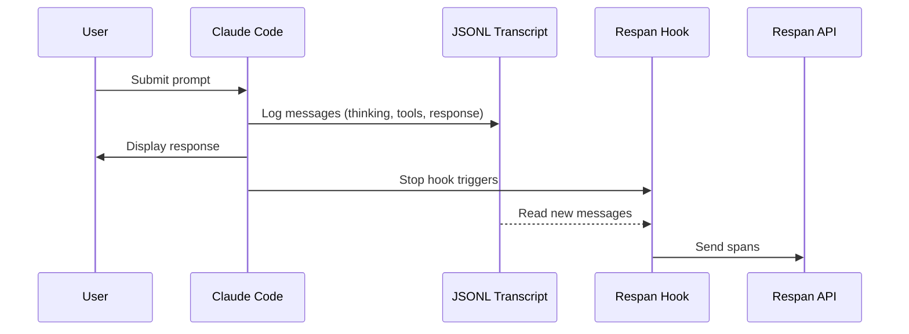

<Accordion title="Set up Respan">
1. **Sign up** — Create an account at [platform.respan.ai](https://platform.respan.ai)
2. **Create an API key** — Generate one on the [API keys page](https://platform.respan.ai/platform/api/api-keys)
3. **Add credits or a provider key** — Add credits on the [Credits page](https://platform.respan.ai/platform/api/credits) or connect your own provider key on the [Integrations page](https://platform.respan.ai/platform/api/integrations)
</Accordion>


<Frame className="rounded-md">

</Frame>

[Claude Code](https://docs.anthropic.com/en/docs/claude-code) is Anthropic's agentic coding tool that lives in your terminal. With Respan integration, you get hierarchical traces of every conversation including thinking blocks, tool calls, and token usage.

## How It Works

Claude Code stores conversation transcripts as JSONL files. Our integration uses the `Stop` hook to parse these transcripts and send structured traces to Respan.



<Tip>
For details on trace structure and span types, see the [Observability Data Model](/documentation/getting-started/observability_data_model).
</Tip>

## Prerequisites

- [Claude Code](https://docs.anthropic.com/en/docs/claude-code) installed (`npm install -g @anthropic-ai/claude-code`)
- [Respan API key](https://platform.respan.ai)
- Python 3.8+ with `requests` library

## Installation

### 1. Set Environment Variables

Add these to your shell profile (`.bashrc`, `.zshrc`, or PowerShell `$PROFILE`):

<CodeGroup>
```bash Bash/Zsh
export RESPAN_API_KEY="your-api-key"
export TRACE_TO_RESPAN="true"

# Optional: Enterprise endpoint (default: api.respan.ai)
# export RESPAN_BASE_URL="https://endpoint.respan.ai/api"

# Optional: Enable debug logging
# export CC_RESPAN_DEBUG="true"
```

```powershell PowerShell
$env:RESPAN_API_KEY = "your-api-key"
$env:TRACE_TO_RESPAN = "true"

# Optional: Enterprise endpoint (default: api.respan.ai)
# $env:RESPAN_BASE_URL = "https://endpoint.respan.ai/api"

# Optional: Enable debug logging
# $env:CC_RESPAN_DEBUG = "true"
```
</CodeGroup>

### 2. Download the Hook Script

Download the hook script to your Claude Code hooks directory:

<CodeGroup>
```bash Bash/Zsh
mkdir -p ~/.claude/hooks
curl -o ~/.claude/hooks/respan_hook.py \
  https://raw.githubusercontent.com/Respan/respan-example-projects/main/example_scripts/python/claude_code/respan_hook.py
```

```powershell PowerShell
New-Item -ItemType Directory -Force -Path "$env:USERPROFILE\.claude\hooks"
Invoke-WebRequest -Uri "https://raw.githubusercontent.com/Respan/respan-example-projects/main/example_scripts/python/claude_code/respan_hook.py" -OutFile "$env:USERPROFILE\.claude\hooks\respan_hook.py"
```
</CodeGroup>

### 3. Configure Claude Code Settings

Add the hook to your Claude Code settings at `~/.claude/settings.json`:

<CodeGroup>
```json macOS/Linux
{
  "hooks": {
    "Stop": [
      {
        "hooks": [
          {
            "type": "command",
            "command": "python ~/.claude/hooks/respan_hook.py"
          }
        ]
      }
    ]
  }
}
```

```json Windows
{
  "hooks": {
    "Stop": [
      {
        "hooks": [
          {
            "type": "command",
            "command": "python \"%USERPROFILE%\\.claude\\hooks\\respan_hook.py\""
          }
        ]
      }
    ]
  }
}
```
</CodeGroup>

<Note>
If `settings.json` already exists, merge the `hooks` section with your existing configuration.
</Note>

### 4. Enable Per-Project (Optional)

To enable tracing for specific projects, create `.claude/settings.local.json` in your project directory:

```json
{
  "hooks": {
    "Stop": [
      {
        "hooks": [
          {
            "type": "command",
            "command": "python ~/.claude/hooks/respan_hook.py"
          }
        ]
      }
    ]
  }
}
```

## Captured Data

The integration captures rich metadata from Claude Code transcripts:

| Data | Description |
|------|-------------|
| **User prompt** | The user's input text |
| **Assistant response** | Claude's final response |
| **Thinking blocks** | Extended thinking content |
| **Tool calls** | Tool name, input, and output |
| **Token usage** | Input, output, and cache tokens |
| **Timing** | Start time, end time, latency |
| **Model** | Model name (e.g., `claude-sonnet-4-20250514`) |

## Span Types

| Span | `log_type` | Description |
|------|------------|-------------|
| Root | `agent` | The complete conversation turn |
| Thinking | `generation` | Extended thinking blocks |
| Tool | `tool` | Tool invocations (Read, Write, Bash, etc.) |

## Trace Fields

| Field | Value | Description |
|-------|-------|-------------|
| `trace_unique_id` | `{session_id}_turn_{N}` | Unique per turn |
| `span_workflow_name` | `claudecode_{session_id}` | Groups all turns in session |
| `thread_identifier` | `claudecode_{session_id}` | Links turns in Threads view |
| `prompt_tokens` | From usage | Input token count |
| `completion_tokens` | From usage | Output token count |
| `cache_creation_prompt_tokens` | From usage | Cache creation tokens |

## Debugging

Check the log file for issues:

<CodeGroup>
```bash Bash/Zsh
tail -f ~/.claude/state/respan_hook.log
```

```powershell PowerShell
Get-Content "$env:USERPROFILE\.claude\state\respan_hook.log" -Tail 50 -Wait
```
</CodeGroup>

### State File

The hook tracks processed turns in `~/.claude/state/respan_state.json`:

```json
{
  "session-abc123": {
    "last_line": 42,
    "turn_count": 5,
    "updated": "2026-01-11T22:49:26Z"
  }
}
```

Delete this file to reprocess all turns.

### Common Issues

| Issue | Solution |
|-------|----------|
| No traces appearing | Check `TRACE_TO_RESPAN=true` is set |
| API errors | Verify `RESPAN_API_KEY` is correct |
| Missing thinking | Ensure extended thinking is enabled in Claude Code |
| Duplicate traces | Clear state file to reset |

## Example Output

After setup, you'll see traces in Respan with full hierarchy:

```
claudecode_abc123_turn_1 (2.5s)
├── Thinking 1 (0.8s) - "Let me read the file first..."
├── Tool: Read (0.1s) - {"path": "main.py"}
├── Thinking 2 (0.5s) - "I see the issue..."
├── Tool: Write (0.1s) - {"path": "main.py", "content": "..."}
└── Token usage: 1,234 prompt / 567 completion
```

## Comparison with Cursor Integration

| Feature | Cursor | Claude Code |
|---------|--------|-------------|
| Hook type | Multiple real-time hooks | Single `Stop` hook |
| Data source | JSON via stdin | JSONL transcript files |
| Timing | Real-time | Post-hoc (after response) |
| Token usage | Not available | Full usage details |
| Cache info | Not available | Cache creation/read tokens |

## Source Code

The full source code is available on GitHub: [Respan/respan-example-projects/claude_code](https://github.com/Repsan/respan-example-projects/tree/main/example_scripts/python/claude_code)

## References

- [Claude Code Documentation](https://docs.anthropic.com/en/docs/claude-code)
- [Respan Traces Ingest API](/apis/observe/traces/traces-ingest-from-logs)
