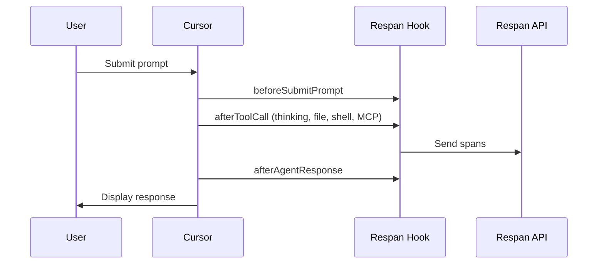

<Accordion title="Set up Respan">
1. **Sign up** — Create an account at [platform.respan.ai](https://platform.respan.ai)
2. **Create an API key** — Generate one on the [API keys page](https://platform.respan.ai/platform/api/api-keys)
3. **Add credits or a provider key** — Add credits on the [Credits page](https://platform.respan.ai/platform/api/credits) or connect your own provider key on the [Integrations page](https://platform.respan.ai/platform/api/integrations)
</Accordion>


<Frame className="rounded-md">

</Frame>

[Cursor](https://cursor.com) is an AI-powered code editor with built-in agent capabilities. With Respan integration, you get hierarchical traces of every agent interaction including thinking blocks, file edits, shell commands, and MCP tool calls.

## How It Works

Cursor provides [hooks](https://cursor.com/docs/agent/hooks) that fire during agent execution. Our integration captures these events in real-time and sends them to Respan as hierarchical traces.



The hook captures **thinking blocks**, **file edits**, **shell commands**, and **MCP tool calls** as child spans under a root agent span.

<Tip>
For details on trace structure and span types, see the [Observability Data Model](/documentation/getting-started/observability_data_model).
</Tip>

## Prerequisites

- [Cursor IDE](https://cursor.com) installed
- [Respan API key](https://platform.respan.ai)
- Python 3.8+ with `requests` library

## Installation

### 1. Set Environment Variables

Add these to your shell profile (`.bashrc`, `.zshrc`, or PowerShell `$PROFILE`):

<CodeGroup>
```bash Bash/Zsh
export RESPAN_API_KEY="your-api-key"
export TRACE_TO_RESPAN="true"

# Optional: Enterprise endpoint (default: api.respan.ai)
# export RESPAN_BASE_URL="https://endpoint.respan.ai/api"

# Optional: Enable debug logging
# export CURSOR_RESPAN_DEBUG="true"
```

```powershell PowerShell
$env:RESPAN_API_KEY = "your-api-key"
$env:TRACE_TO_RESPAN = "true"

# Optional: Enterprise endpoint (default: api.respan.ai)
# $env:RESPAN_BASE_URL = "https://endpoint.respan.ai/api"

# Optional: Enable debug logging
# $env:CURSOR_RESPAN_DEBUG = "true"
```
</CodeGroup>

### 2. Download the Hook Script

Download the hook script to your Cursor hooks directory:

<CodeGroup>
```bash Bash/Zsh
mkdir -p ~/.cursor/hooks
curl -o ~/.cursor/hooks/respan_hook.py \
  https://raw.githubusercontent.com/Respan/respan-example-projects/main/example_scripts/python/cursor/respan_hook.py
```

```powershell PowerShell
New-Item -ItemType Directory -Force -Path "$env:USERPROFILE\.cursor\hooks"
Invoke-WebRequest -Uri "https://raw.githubusercontent.com/Respan/respan-example-projects/main/example_scripts/python/cursor/respan_hook.py" -OutFile "$env:USERPROFILE\.cursor\hooks\respan_hook.py"
```
</CodeGroup>

### 3. Configure Cursor Hooks

Create `~/.cursor/hooks.json` with the following configuration:

<CodeGroup>
```json macOS/Linux
{
  "version": 1,
  "hooks": {
    "beforeSubmitPrompt": [
      { "command": "python ~/.cursor/hooks/respan_hook.py" }
    ],
    "afterAgentThought": [
      { "command": "python ~/.cursor/hooks/respan_hook.py" }
    ],
    "afterAgentResponse": [
      { "command": "python ~/.cursor/hooks/respan_hook.py" }
    ],
    "afterShellExecution": [
      { "command": "python ~/.cursor/hooks/respan_hook.py" }
    ],
    "afterFileEdit": [
      { "command": "python ~/.cursor/hooks/respan_hook.py" }
    ],
    "afterMCPExecution": [
      { "command": "python ~/.cursor/hooks/respan_hook.py" }
    ],
    "stop": [
      { "command": "python ~/.cursor/hooks/respan_hook.py" }
    ]
  }
}
```

```json Windows
{
  "version": 1,
  "hooks": {
    "beforeSubmitPrompt": [
      { "command": "python \"%USERPROFILE%\\.cursor\\hooks\\respan_hook.py\"" }
    ],
    "afterAgentThought": [
      { "command": "python \"%USERPROFILE%\\.cursor\\hooks\\respan_hook.py\"" }
    ],
    "afterAgentResponse": [
      { "command": "python \"%USERPROFILE%\\.cursor\\hooks\\respan_hook.py\"" }
    ],
    "afterShellExecution": [
      { "command": "python \"%USERPROFILE%\\.cursor\\hooks\\respan_hook.py\"" }
    ],
    "afterFileEdit": [
      { "command": "python \"%USERPROFILE%\\.cursor\\hooks\\respan_hook.py\"" }
    ],
    "afterMCPExecution": [
      { "command": "python \"%USERPROFILE%\\.cursor\\hooks\\respan_hook.py\"" }
    ],
    "stop": [
      { "command": "python \"%USERPROFILE%\\.cursor\\hooks\\respan_hook.py\"" }
    ]
  }
}
```
</CodeGroup>

### 4. Restart Cursor

Restart Cursor IDE to apply the hooks configuration.

## Hooks Reference

| Hook | Trigger | Data Captured |
|------|---------|---------------|
| `beforeSubmitPrompt` | User sends prompt | User input, start time |
| `afterAgentThought` | Agent thinking | Thinking text, duration |
| `afterShellExecution` | Shell command completes | Command, output, duration |
| `afterFileEdit` | File edited | File path, edits |
| `afterMCPExecution` | MCP tool completes | Tool name, input, output, duration |
| `afterAgentResponse` | Agent responds | Response text (creates root span) |
| `stop` | Agent stops | Cleanup |

## Span Types

| Span | `log_type` | Description |
|------|------------|-------------|
| Root | `agent` | The complete agent turn |
| Thinking | `generation` | Agent reasoning blocks |
| Shell/File/MCP | `tool` | Tool invocations |

## Trace Fields

| Field | Value | Description |
|-------|-------|-------------|
| `trace_unique_id` | `{conversation_id}_{generation_id}` | Unique per turn |
| `span_workflow_name` | `cursor_{conversation_id}` | Groups all turns |
| `thread_identifier` | `cursor_{conversation_id}` | Links turns in Threads view |

## Debugging

Check the log file for issues:

<CodeGroup>
```bash Bash/Zsh
tail -f ~/.cursor/state/respan_hook.log
```

```powershell PowerShell
Get-Content "$env:USERPROFILE\.cursor\state\respan_hook.log" -Tail 50 -Wait
```
</CodeGroup>

### Common Issues

| Issue | Solution |
|-------|----------|
| No traces appearing | Check `TRACE_TO_RESPAN=true` is set |
| API errors | Verify `RESPAN_API_KEY` is correct |
| Only root span | Ensure all hooks are configured in `hooks.json` |
| Missing thinking | Check `afterAgentThought` hook is active |

## Example Output

After setup, you'll see traces in Respan with full hierarchy:

```
cursor_abc123_xyz789 (38.9s)
├── Thinking 1 (0.5s) - "Let me analyze the code..."
├── Thinking 2 (0.3s) - "I should update the function..."
├── Edit: utils.py (0.1s)
├── Shell: npm test (4.1s)
└── Thinking 3 (0.2s) - "Tests passed, done."
```

## Source Code

The full source code is available on GitHub: [Respan/respan-example-projects/cursor](https://github.com/Repsan/respan-example-projects/tree/main/example_scripts/python/cursor)

## References

- [Cursor Hooks Documentation](https://cursor.com/docs/agent/hooks)
- [Respan Traces Ingest API](/apis/observe/traces/traces-ingest-from-logs)
